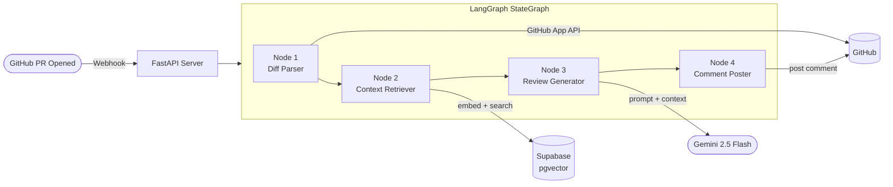
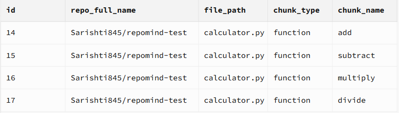

# RepoMind — Agentic GitHub Code Review Copilot


> **An agentic system that automatically reviews GitHub pull requests** — fetches the diff, retrieves relevant codebase context via pgvector RAG, generates structured feedback via Gemini 2.5 Flash, and posts inline comments. Zero manual action required.

🔗 **Live:** https://repomind-vlry.onrender.com &nbsp;|&nbsp; 📁 **Repo:** https://github.com/Sarishti845/RepoMind

---

## What it does

Open a pull request → RepoMind automatically:

| Step | Action |
|------|--------|
| 1 | Receives GitHub webhook (HMAC verified) |
| 2 | Fetches the PR diff via GitHub App API |
| 3 | Indexes codebase with AST chunking + embeddings → pgvector |
| 4 | Retrieves top-5 semantically similar functions as context |
| 5 | Calls Gemini 2.5 Flash with diff + context + language hints |
| 6 | Posts structured review as PR comment |

---

## Architecture



**AgentState** — a TypedDict — flows through all 4 nodes. Each node reads what it needs and writes only its output back. No node talks directly to another.

---

## Demo

> RepoMind automatically reviewing a PR — from webhook received to comment posted in under 10 seconds.


**What you're seeing:** A PR is opened containing SQL injection, a missing WHERE clause on DELETE, and a mutable default argument. RepoMind's bot detects all of them automatically and posts a structured review with suggested fixes — zero manual action required.

---

## RAG Storage — pgvector in action

Code chunks from the repository are embedded and stored in Supabase pgvector. When a PR opens, the diff is embedded and the top-5 most semantically similar chunks are retrieved as context for Gemini.



Each row stores: `repo_full_name`, `file_path`, `chunk_type`, `chunk_name`, `content`, and a `vector(384)` embedding used for cosine similarity search.

---

## RAG in action

When a new `percentage()` function was added in a PR, Gemini flagged:

> *"The percentage() function will raise a ZeroDivisionError if total is 0, **similar to the divide() function in the existing calculator.py**"*

Gemini knew about `divide()` — which was **not in the diff** — because it was retrieved from pgvector and injected as context. This is codebase-aware review, not just diff-aware.

---

## Tech Stack

| Layer | Technology | Why |
|---|---|---|
| Backend | FastAPI + Uvicorn | Async webhook handling, fast startup |
| Agent pipeline | LangGraph StateGraph | Retryable nodes, inspectable state, clean separation |
| LLM | Gemini 2.5 Flash | Free tier, fast, strong code reasoning |
| RAG — chunking | Python `ast` module | AST-aware splits guarantee complete function/class units |
| RAG — embeddings | fastembed (all-MiniLM-L6-v2) | 384-dim vectors, ONNX runtime — no PyTorch needed |
| RAG — storage | Supabase pgvector | Cosine similarity search with ivfflat index |
| GitHub integration | GitHub Apps + PyGithub | Scoped permissions, short-lived JWT tokens, bot identity |
| Deployment | Docker + Render | Containerized, auto-deploys on every push to main |

---

## Key Engineering Decisions

**Why LangGraph over a plain function chain?**
Each node owns one responsibility. If Gemini's API changes, only Node 3 changes. Nodes are independently retryable — a Gemini failure doesn't re-fetch the diff. Adding a step is `add_node()` + `add_edge()`.

**Why AST chunking over line splits?**
`ast.parse()` guarantees every chunk is a complete, syntactically valid unit. Line-count splitting could cut a function midway, producing meaningless embeddings.

**Why fastembed over sentence-transformers?**
`sentence-transformers` pulls in PyTorch — 2GB+ with CUDA on Linux, causing build timeouts on Render's free tier. `fastembed` uses ONNX runtime, produces identical 384-dim vectors, deploys in under 5 minutes.

**Why GitHub App over a Personal Access Token?**
GitHub Apps have scoped per-installation permissions, generate short-lived tokens via JWT exchange, and act as a separate bot identity not tied to any personal account.

---

## Project Structure

```
repomind/
├── app/
│   ├── main.py              # FastAPI entry point, router mounting
│   ├── webhook_handler.py   # HMAC verification, pipeline invocation
│   ├── pipeline.py          # LangGraph StateGraph — AgentState + 4 nodes
│   ├── github_client.py     # GitHub App JWT auth, diff fetch, comment posting
│   ├── gemini_reviewer.py   # Prompt engineering, language detection, Gemini call
│   ├── chunker.py           # AST-based code chunking (functions + classes)
│   └── embedder.py          # fastembed vectors, pgvector storage + retrieval
├── Dockerfile               # python:3.12-slim, uvicorn on 0.0.0.0:8000
└── requirements.txt
```

---

## Local Setup

### Prerequisites

Before running RepoMind, you need to create:

1. **GitHub App** — [Create one here](https://github.com/settings/apps/new)
   - Webhook URL: your ngrok URL + `/webhooks/github`
   - Permissions: Pull requests (Read & Write), Contents (Read), Metadata (Read)
   - Events: Pull request
   - Generate and download a private key (`.pem` file)

2. **Supabase project** — [Create one here](https://supabase.com)
   - Enable the `vector` extension under Database → Extensions
   - Run this in SQL Editor:
```sql
   CREATE TABLE code_chunks (
       id BIGSERIAL PRIMARY KEY,
       repo_full_name TEXT NOT NULL,
       file_path TEXT NOT NULL,
       chunk_type TEXT NOT NULL,
       chunk_name TEXT NOT NULL,
       content TEXT NOT NULL,
       embedding vector(384),
       created_at TIMESTAMPTZ DEFAULT NOW()
   );
   CREATE INDEX ON code_chunks
   USING ivfflat (embedding vector_cosine_ops)
   WITH (lists = 100);
```
   - Copy the **Session pooler** connection URL from Connect → Direct

3. **Gemini API key** — [Get one here](https://aistudio.google.com/apikey) (free)

---

### Installation

```bash
git clone https://github.com/Sarishti845/RepoMind.git
cd RepoMind
python -m venv venv
venv\Scripts\activate        # Windows
source venv/bin/activate     # Mac/Linux
pip install -r requirements.txt
```

Create `.env` in the root folder:
```env
GITHUB_APP_ID=your_github_app_id
GITHUB_PRIVATE_KEY_PATH=your_key.pem
GITHUB_WEBHOOK_SECRET=your_webhook_secret
DATABASE_URL=your_supabase_session_pooler_url
GEMINI_API_KEY=your_gemini_api_key
```

```bash
uvicorn app.main:app --reload --port 8000
ngrok http 8000
```

Update your GitHub App's webhook URL to:
https://your-ngrok-url.ngrok-free.app/webhooks/github

Then install your GitHub App on any repo — every PR will be reviewed automatically.

---

### Deploy to Render (permanent URL)

1. Fork this repo
2. Create a new Web Service on [Render](https://render.com) → connect your fork
3. Add environment variables (same as `.env` above, but use `GITHUB_PRIVATE_KEY` with the full key contents instead of a file path)
4. Deploy — Render uses the Dockerfile automatically

---

## Built by

**Sarishti** — Final year B.Tech CSE, TIET (CGPA 9.50)
Amazon ML Summer School 2024 — selected from 80,000 applicants (top ~3,000)

*Built end-to-end as a solo project — every line written, debugged, and deployed independently.*